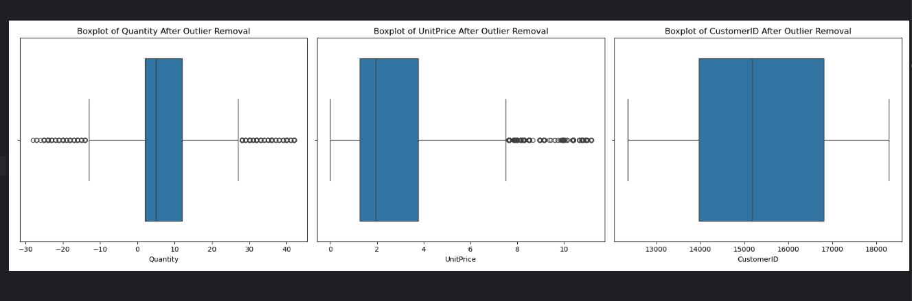

Online Retail Data Mining & Analytics Project
🚀 Overview
This project explores an Online Retail dataset with transactional records from an e-commerce business. The primary goal is to leverage data mining and machine learning techniques to uncover actionable insights into customer behavior, optimize marketing strategies, and forecast future sales.

Using a combination of RFM metrics, customer segmentation, recommendation systems, and time-series forecasting, this repository provides a comprehensive pipeline to turn raw data into meaningful business strategies.

🛠️ Project Pipeline
1. Data Import & Cleaning
Load the dataset (OnlineRetail.xlsx) into a Pandas DataFrame.
Handle missing values (CustomerID and Description), remove duplicates, and detect outliers.
Compute TotalPrice = Quantity × UnitPrice.
Visual Example: Outlier Detection

2. Exploratory Data Analysis (EDA)
Summarize metrics like spending patterns by Country, CustomerID, and InvoiceNo.
Identify and separate returns (negative Quantity or Price) to compute ReturnRate and ReturnCount.
Visualize distributions with histograms, boxplots, and heatmaps to detect anomalies.
Visual Example: Correlation Matrix Heatmap

3. RFM Metrics & Feature Engineering
Recency: Days since the last purchase.
Frequency: Number of unique transactions.
Monetary: Total spending per customer.
Additional Metrics:
Average Order Value (AvgOrderValue).
Approximate Customer Lifetime Value (CLV) using a discount factor.
LoyaltyScore: Combines frequency and return rate for customer loyalty insights.
Visual Example: RFM Metrics Breakdown

4. Customer Segmentation
Cluster customers using KMeans on PCA-reduced features (e.g., Recency, Frequency, CLV).
Manually assign high-value outliers (e.g., VIP customers) to a separate cluster.
Visualize clusters with PCA scatterplots and analyze their behavior.
Visual Example: Customer Segmentation with KMeans

5. Recommendation Systems
Collaborative Filtering: Suggest products based on customer similarity (user-user).
Content-Based Filtering: Recommend similar products using metadata (Price, Popularity, Category, Brand).
Output: Personalized product suggestions for customers and related item recommendations.
Visual Example: Collaborative Recommendations

6. Predictive Modeling
Build a GradientBoostingRegressor to predict AvgOrderValue using features like Recency, Frequency, and CLV.
Perform hyperparameter tuning with GridSearchCV and compare with baseline models (RandomForest, XGBoost, etc.).
Evaluate performance with metrics like RMSE and feature importance.
Visual Example: RMSE and Feature Importance

7. Time-Series Forecasting (Prophet)
Aggregate invoices into daily sales data (TotalPrice).
Use Prophet to:
Forecast future sales and trends (next 6 months).
Evaluate the forecast on recent data with RMSE.
Incorporate seasonality and holiday effects into predictions.
Visual Example: Prophet Forecast for the Next 6 Months

📈 Insights & Strategy
What We Achieve:
Customer Segmentation:

Identify high-value customers and target them with VIP campaigns.
Spot high-return customers to improve product descriptions and reduce friction.
Sales Trends:

Highlight seasonal or monthly spending patterns to align inventory and marketing strategies.
Forecast future sales for better budget planning.
Personalized Recommendations:

Improve user experience by suggesting relevant products.
Boost cross-selling and up-selling opportunities.

📂 Key Files
File	Description
OnlineRetail.xlsx	Raw transactional data containing details like InvoiceNo, CustomerID, Quantity, and UnitPrice.
purchase_data.csv	Derived from non-return transactions, used for recommendation systems.
product_metadata.csv	Enriched product data (Price, Popularity, Category, Brand) for similarity-based recommendations.
RFM Scripts	Calculates RFM metrics, clusters customers, and stores segmentation results.
Recommendation Scripts	Implements collaborative filtering and content-based product similarity algorithms.
Forecasting Scripts	Performs time-series forecasting using Prophet to predict future sales and trends.

🛠️ How to Run
Install Requirements
Ensure you have Python and the necessary libraries:

pip install pandas numpy matplotlib seaborn scikit-learn statsmodels prophet
pip install xgboost lightgbm catboost  # Optional for additional models
Place the Dataset
Ensure OnlineRetail.xlsx is in the correct directory. Adjust file paths in the code if necessary.

Execute Scripts

Load and clean the dataset.
Perform EDA and outlier removal.
Build RFM metrics and segment customers.
Generate recommendations and predictive models.
Forecast future sales with Prophet.
Review Outputs

Plots: Visualize distributions, clusters, and trends.
Recommendations: Explore suggested products for sample customers.
Forecast Charts: Analyze sales seasonality and trends.

🔍 Future Enhancements
Advanced Outlier Detection: Use IsolationForest or domain-specific thresholds for more precise outlier handling.
Hybrid Recommendations: Combine collaborative and content-based approaches into a single system.
Time-Based Validation: Implement rolling or expanding windows for time-sensitive predictive tasks.
Holiday Regressors: Add holiday or event calendars to improve Prophet’s forecasting accuracy.
Dynamic CLV Models: Build customer lifetime value models that adapt to behavior changes over time.

🌟 Real-World Applications
Customer Relationship Management (CRM): Leverage RFM metrics for personalized marketing and loyalty programs.
Inventory Management: Optimize stock levels using demand forecasts from time-series analysis.
Revenue Growth: Enhance revenue with personalized recommendations and targeted campaigns.
Strategic Planning: Use forecasts to align resources for peak sales periods.

🙌 Conclusion
This project demonstrates a complete data mining pipeline, combining RFM segmentation, clustering, recommendations, and forecasting to unlock the power of transactional data. Businesses can:

Optimize marketing efforts with actionable customer insights.
Enhance customer satisfaction through personalized recommendations.
Plan inventory and budgets effectively with accurate forecasts.
Feel free to fork, contribute, or raise issues for further improvements. Let’s unlock the power of data-driven insights together! 🚀
